# CLASS DIAGRAM & ENTITY RELATIONSHIP - SISTEM SMART MOTORCYCLE MANAGEMENT

Dokumen ini menampilkan struktur class/entity dan relasi antar tabel dalam sistem.

---

## 1. CLASS DIAGRAM (Object-Oriented Perspective)

```mermaid
classDiagram
    class User {
        -int id
        -string name
        -string email
        -string password
        -string phone
        -string role [admin|member]
        -datetime email_verified_at
        -string refresh_token
        -datetime created_at
        +register()
        +login()
        +updateProfile()
        +changePassword()
    }

    class Vehicle {
        -int id
        -int user_id
        -string name
        -string brand
        -string type
        -int year
        -string plate_number
        -float odometer
        -boolean is_primary
        -string device_id
        -json last_telemetry_data
        +addVehicle()
        +setPrimary()
        +updateOdometer()
        +getMaintenanceRecommendations()
    }

    class ServiceHistory {
        -int id
        -int vehicle_id
        -int service_type_id
        -string description
        -float cost
        -string mechanic_name
        -string receipt_path
        -datetime service_date
        +recordService()
        +uploadReceipt()
        +getCostSummary()
    }

    class ServiceSchedule {
        -int id
        -int vehicle_id
        -string service_name
        -int interval_km
        -int interval_months
        -float threshold_percent
        -boolean is_notified
        -datetime reminder_threshold_date
        -datetime created_at
        +evaluateStatus()
        +checkReminders()
        +resetReminder()
    }

    class Trip {
        -int id
        -int vehicle_id
        -int user_id
        -string status [active|completed]
        -datetime started_at
        -datetime ended_at
        -float distance_meters
        -int duration_seconds
        -json telemetry_data
        +startTracking()
        +stopTracking()
        +calculateDistance()
    }

    class TripPoint {
        -int id
        -int trip_id
        -float latitude
        -float longitude
        -float accuracy_meters
        -float distance_from_previous
        -datetime recorded_at
    }

    class MQTTMessage {
        -int id
        -int user_id
        -string topic
        -json payload
        -float latitude
        -float longitude
        -string address
        -datetime received_at
    }

    class Tip {
        -int id
        -string title
        -string slug
        -string description
        -string content
        -string thumbnail_path
        -string status [draft|published]
        -int likes_count
        -int ratings_count
        -datetime published_at
        +publishTip()
        +likeTip()
        +rateTip()
        +bookmarkTip()
    }

    class TipTag {
        -int id
        -string name
        -string slug
    }

    class TipStep {
        -int id
        -int tip_id
        -int step_number
        -string title
        -string description
        -string image_path
    }

    class TipTool {
        -int id
        -int tip_id
        -string tool_name
        -string description
    }

    class TipLike {
        -int id
        -int tip_id
        -int user_id
        -datetime created_at
    }

    class TipRating {
        -int id
        -int tip_id
        -int user_id
        -int rating [1-5]
        -datetime created_at
    }

    class MotorTypeComponent {
        -int id
        -int motor_type_id
        -string component_name
        -string slug
        -int max_interval_km
        -int max_interval_months
        -string criticality [low|medium|high]
    }

    class FuzzyComponentConfig {
        -int id
        -int component_id
        -float fuzzy_low_threshold
        -float fuzzy_medium_threshold
        -float fuzzy_high_threshold
        -string rule_description
    }

    class AIRecommendationCache {
        -int id
        -int vehicle_id
        -string insight_text
        -json component_scores
        -datetime cached_at
        -datetime expires_at
    }

    class Notification {
        -int id
        -int user_id
        -int category_id
        -string title
        -string message
        -string type [reminder|promo|system]
        -boolean is_read
        -datetime created_at
        +markAsRead()
    }

    class NotificationCategory {
        -int id
        -string name
        -string description
    }

    class NotificationPreference {
        -int id
        -int user_id
        -int category_id
        -boolean is_enabled
        -boolean enable_sound
    }

    class DeviceToken {
        -int id
        -int user_id
        -string fcm_token
        -string device_name
        -string device_os
        -boolean is_active
        +registerToken()
        +unregisterToken()
    }

    class Content {
        -int id
        -string title
        -string slug
        -string body
        -string type [terms|privacy|faq]
        -datetime updated_at
    }

    class ServiceType {
        -int id
        -string name
        -string description
        -boolean is_active
    }

    class ReminderOption {
        -int id
        -string name
        -string channel [email|sms|push]
        -int days_before
        -boolean is_active
    }

    %% Relationships
    User "1" -- "*" Vehicle : owns
    User "1" -- "*" Trip : makes
    User "1" -- "*" TipLike : gives
    User "1" -- "*" TipRating : gives
    User "1" -- "*" Notification : receives
    User "1" -- "*" DeviceToken : registers
    User "1" -- "*" NotificationPreference : sets

    Vehicle "1" -- "*" Trip : has
    Vehicle "1" -- "*" ServiceHistory : records
    Vehicle "1" -- "*" ServiceSchedule : tracks
    Vehicle "*" -- "1" MotorTypeComponent : contains

    Trip "1" -- "*" TripPoint : composed_of
    Trip "1" -- "*" MQTTMessage : generates

    ServiceHistory "*" -- "1" ServiceType : categorized_by

    Tip "1" -- "*" TipTag : tagged_with
    Tip "1" -- "*" TipStep : has_steps
    Tip "1" -- "*" TipTool : requires
    Tip "1" -- "*" TipLike : receives
    Tip "1" -- "*" TipRating : receives

    MotorTypeComponent "1" -- "*" FuzzyComponentConfig : configures
    MotorTypeComponent "1" -- "*" AIRecommendationCache : scores

    Notification "*" -- "1" NotificationCategory : categorized_by
    NotificationPreference "*" -- "1" NotificationCategory : manages
    NotificationPreference "*" -- "1" User : belongs_to
```



---

## 2. ENTITY RELATIONSHIP DIAGRAM (Database Structure)

```mermaid
erDiagram
    USERS ||--o{ VEHICLES : owns
    USERS ||--o{ TRIPS : creates
    USERS ||--o{ SERVICE_HISTORIES : records
    USERS ||--o{ NOTIFICATIONS : receives
    USERS ||--o{ DEVICE_TOKENS : registers
    USERS ||--o{ NOTIFICATION_PREFERENCES : configures
    USERS ||--o{ TIP_LIKES : gives
    USERS ||--o{ TIP_RATINGS : gives

    VEHICLES ||--o{ TRIPS : generates
    VEHICLES ||--o{ SERVICE_HISTORIES : logs
    VEHICLES ||--o{ SERVICE_SCHEDULES : tracks
    VEHICLES ||--o{ MQTT_MESSAGES : transmits
    VEHICLES }o--|| MOTOR_TYPE_COMPONENTS : contains

    TRIPS ||--o{ TRIP_POINTS : composes
    TRIPS ||--o{ MQTT_MESSAGES : represents

    SERVICE_HISTORIES }o--|| SERVICE_TYPES : uses
    SERVICE_SCHEDULES }o--|| REMINDER_OPTIONS : reminds

    TIPS ||--o{ TIP_TAGS : tags
    TIPS ||--o{ TIP_STEPS : procedures
    TIPS ||--o{ TIP_TOOLS : requires
    TIPS ||--o{ TIP_LIKES : likes
    TIPS ||--o{ TIP_BOOKMARKS : bookmarks
    TIPS ||--o{ TIP_RATINGS : rates
    TIPS ||--o{ TIP_SHARES : shares

    MOTOR_TYPE_COMPONENTS ||--o{ FUZZY_COMPONENT_CONFIGS : fuzzy
    MOTOR_TYPE_COMPONENTS ||--o{ AI_RECOMMENDATION_CACHES : scores

    NOTIFICATIONS }o--|| NOTIFICATION_CATEGORIES : categorized
    NOTIFICATION_PREFERENCES }o--|| NOTIFICATION_CATEGORIES : manages

    USERS : int id PK
    USERS : string name
    USERS : string email UK
    USERS : string password
    USERS : string phone
    USERS : string role
    USERS : datetime email_verified_at
    USERS : string refresh_token
    USERS : timestamp created_at

    VEHICLES : int id PK
    VEHICLES : int user_id FK
    VEHICLES : string name
    VEHICLES : string brand
    VEHICLES : string type
    VEHICLES : int year
    VEHICLES : string plate_number
    VEHICLES : float odometer
    VEHICLES : boolean is_primary
    VEHICLES : string device_id
    VEHICLES : json last_telemetry_data
    VEHICLES : timestamp created_at

    TRIPS : int id PK
    TRIPS : int vehicle_id FK
    TRIPS : int user_id FK
    TRIPS : string status
    TRIPS : datetime started_at
    TRIPS : datetime ended_at
    TRIPS : float distance_meters
    TRIPS : int duration_seconds
    TRIPS : json telemetry_data
    TRIPS : timestamp created_at

    TRIP_POINTS : int id PK
    TRIP_POINTS : int trip_id FK
    TRIP_POINTS : float latitude
    TRIP_POINTS : float longitude
    TRIP_POINTS : float accuracy_meters
    TRIP_POINTS : float distance_from_previous
    TRIP_POINTS : datetime recorded_at

    SERVICE_HISTORIES : int id PK
    SERVICE_HISTORIES : int vehicle_id FK
    SERVICE_HISTORIES : int service_type_id FK
    SERVICE_HISTORIES : string description
    SERVICE_HISTORIES : float cost
    SERVICE_HISTORIES : string mechanic_name
    SERVICE_HISTORIES : string receipt_path
    SERVICE_HISTORIES : datetime service_date
    SERVICE_HISTORIES : timestamp created_at

    SERVICE_SCHEDULES : int id PK
    SERVICE_SCHEDULES : int vehicle_id FK
    SERVICE_SCHEDULES : string service_name
    SERVICE_SCHEDULES : int interval_km
    SERVICE_SCHEDULES : int interval_months
    SERVICE_SCHEDULES : float threshold_percent
    SERVICE_SCHEDULES : boolean is_notified
    SERVICE_SCHEDULES : datetime reminder_threshold_date
    SERVICE_SCHEDULES : timestamp created_at

    SERVICE_TYPES : int id PK
    SERVICE_TYPES : string name
    SERVICE_TYPES : string description
    SERVICE_TYPES : boolean is_active

    MQTT_MESSAGES : int id PK
    MQTT_MESSAGES : int user_id FK
    MQTT_MESSAGES : string topic
    MQTT_MESSAGES : json payload
    MQTT_MESSAGES : float latitude
    MQTT_MESSAGES : float longitude
    MQTT_MESSAGES : string address
    MQTT_MESSAGES : datetime received_at

    TIPS : int id PK
    TIPS : string title
    TIPS : string slug UK
    TIPS : string description
    TIPS : string content
    TIPS : string status
    TIPS : int likes_count
    TIPS : int ratings_count
    TIPS : datetime published_at
    TIPS : timestamp created_at

    TIP_TAGS : int id PK
    TIP_TAGS : string name
    TIP_TAGS : string slug

    TIP_TAG_PIVOT : int tip_id FK
    TIP_TAG_PIVOT : int tag_id FK

    TIP_STEPS : int id PK
    TIP_STEPS : int tip_id FK
    TIP_STEPS : int step_number
    TIP_STEPS : string title
    TIP_STEPS : string description
    TIP_STEPS : string image_path

    TIP_TOOLS : int id PK
    TIP_TOOLS : int tip_id FK
    TIP_TOOLS : string tool_name
    TIP_TOOLS : string description

    TIP_LIKES : int id PK
    TIP_LIKES : int tip_id FK
    TIP_LIKES : int user_id FK

    TIP_RATINGS : int id PK
    TIP_RATINGS : int tip_id FK
    TIP_RATINGS : int user_id FK
    TIP_RATINGS : int rating
    TIP_RATINGS : timestamp created_at

    MOTOR_TYPE_COMPONENTS : int id PK
    MOTOR_TYPE_COMPONENTS : string component_name
    MOTOR_TYPE_COMPONENTS : string slug
    MOTOR_TYPE_COMPONENTS : int max_interval_km
    MOTOR_TYPE_COMPONENTS : int max_interval_months
    MOTOR_TYPE_COMPONENTS : string criticality

    FUZZY_COMPONENT_CONFIGS : int id PK
    FUZZY_COMPONENT_CONFIGS : int component_id FK
    FUZZY_COMPONENT_CONFIGS : float fuzzy_low_threshold
    FUZZY_COMPONENT_CONFIGS : float fuzzy_medium_threshold
    FUZZY_COMPONENT_CONFIGS : float fuzzy_high_threshold

    AI_RECOMMENDATION_CACHES : int id PK
    AI_RECOMMENDATION_CACHES : int vehicle_id FK
    AI_RECOMMENDATION_CACHES : text insight_text
    AI_RECOMMENDATION_CACHES : json component_scores
    AI_RECOMMENDATION_CACHES : datetime cached_at
    AI_RECOMMENDATION_CACHES : datetime expires_at

    NOTIFICATIONS : int id PK
    NOTIFICATIONS : int user_id FK
    NOTIFICATIONS : int category_id FK
    NOTIFICATIONS : string title
    NOTIFICATIONS : string message
    NOTIFICATIONS : string type
    NOTIFICATIONS : boolean is_read
    NOTIFICATIONS : timestamp created_at

    NOTIFICATION_CATEGORIES : int id PK
    NOTIFICATION_CATEGORIES : string name
    NOTIFICATION_CATEGORIES : string description

    NOTIFICATION_PREFERENCES : int id PK
    NOTIFICATION_PREFERENCES : int user_id FK
    NOTIFICATION_PREFERENCES : int category_id FK
    NOTIFICATION_PREFERENCES : boolean is_enabled
    NOTIFICATION_PREFERENCES : boolean enable_sound

    DEVICE_TOKENS : int id PK
    DEVICE_TOKENS : int user_id FK
    DEVICE_TOKENS : string fcm_token
    DEVICE_TOKENS : string device_name
    DEVICE_TOKENS : string device_os
    DEVICE_TOKENS : boolean is_active

    REMINDER_OPTIONS : int id PK
    REMINDER_OPTIONS : string name
    REMINDER_OPTIONS : string channel
    REMINDER_OPTIONS : int days_before
    REMINDER_OPTIONS : boolean is_active

    CONTENTS : int id PK
    CONTENTS : string title
    CONTENTS : string slug
    CONTENTS : text body
    CONTENTS : string type
    CONTENTS : timestamp updated_at
```

---

## 3. Data Type & Constraints

### Primary Keys (PK)

Semua tabel menggunakan `id` (INTEGER, AUTO_INCREMENT) sebagai Primary Key

### Foreign Keys (FK)

- `vehicles.user_id` → `users.id` (CASCADE DELETE)
- `trips.vehicle_id` → `vehicles.id` (CASCADE DELETE)
- `trips.user_id` → `users.id` (CASCADE DELETE)
- `service_histories.vehicle_id` → `vehicles.id` (CASCADE DELETE)
- `service_schedules.vehicle_id` → `vehicles.id` (CASCADE DELETE)
- `tip_likes.tip_id` → `tips.id` (CASCADE DELETE)
- `tip_likes.user_id` → `users.id` (CASCADE DELETE)

### Unique Keys (UK)

- `users.email` - Setiap email hanya satu pengguna
- `tips.slug` - Setiap artikel punya slug unik untuk URL-friendly

### Indexes (Performance)

- `vehicles.user_id` - Mempercepat query "select vehicles by user"
- `trips.vehicle_id` - Mempercepat query "select trips by vehicle"
- `notifications.user_id` - Mempercepat inbox queries
- `tips.status` - Filter tips by published/draft status

---

## 4. Cardinality Relationship Explanation

| Hubungan                            | Cardinality | Penjelasan                                                          |
| ----------------------------------- | ----------- | ------------------------------------------------------------------- |
| User ↔ Vehicle                      | 1:N         | Seorang user bisa punya banyak motor                                |
| Vehicle ↔ Trip                      | 1:N         | Satu motor bisa punya banyak perjalanan                             |
| Vehicle ↔ ServiceSchedule           | 1:N         | Satu motor bisa punya banyak jadwal servis                          |
| Trip ↔ TripPoint                    | 1:N         | Satu perjalanan terdiri dari banyak titik GPS                       |
| Tip ↔ TipTag                        | N:M         | Satu artikel bisa punya banyak tag, satu tag bisa di banyak artikel |
| Tip ↔ TipLike                       | 1:N         | Satu artikel bisa di-like oleh banyak user                          |
| MotorTypeComponent ↔ FuzzyConfig    | 1:N         | Satu komponen punya satu konfigurasi Fuzzy                          |
| Notification ↔ NotificationCategory | N:1         | Banyak notifikasi bisa masuk 1 kategori                             |

---

## 5. Catatan Teknis untuk Skripsi

### A. Normalisasi Database

Database sudah dinormalisasi sampai **3NF (Third Normal Form)**:

- ✅ Tidak ada redundansi data
- ✅ Semua atribut non-key dependent pada primary key (2NF)
- ✅ Tidak ada transitive dependency (3NF)

### B. Integritas Data

- Foreign Key Constraints: Menjaga referensi antar tabel
- Unique Constraints: Mencegah duplikasi email dan slug
- Check Constraints: Role hanya boleh `admin` atau `member`

### C. Indexing Strategy

```sql
-- Performance optimization indexes
CREATE INDEX idx_vehicles_user_id ON vehicles(user_id);
CREATE INDEX idx_trips_vehicle_id ON trips(vehicle_id);
CREATE INDEX idx_notifications_user_id ON notifications(user_id);
CREATE INDEX idx_tips_status ON tips(status);
CREATE INDEX idx_service_schedules_vehicle_id ON service_schedules(vehicle_id);
```

### D. Query Pattern Examples

```sql
-- Ambil semua motor milik user tertentu
SELECT * FROM vehicles WHERE user_id = 123;

-- Hitung total perjalanan bulan ini
SELECT COUNT(*) FROM trips
WHERE vehicle_id = 456
AND MONTH(created_at) = MONTH(NOW());

-- Cari tips dengan tag tertentu
SELECT t.* FROM tips t
INNER JOIN tip_tag_pivot ttp ON t.id = ttp.tip_id
INNER JOIN tip_tags tt ON tt.id = ttp.tag_id
WHERE tt.name = 'perawatan-oli' AND t.status = 'published';

-- Evaluasi servis yang sudah overdue
SELECT * FROM service_schedules
WHERE threshold_percent >= 80 AND is_notified = false;
```

---

**Catatan untuk Pemaparan di Skripsi:**

- Gunakan diagram Class sebagai representasi struktur OOP
- Gunakan ERD sebagai visualisasi relasi database
- Jelaskan cardinality dengan contoh data nyata
- Sertakan SQL constraints dan indexes di bagian implementasi
