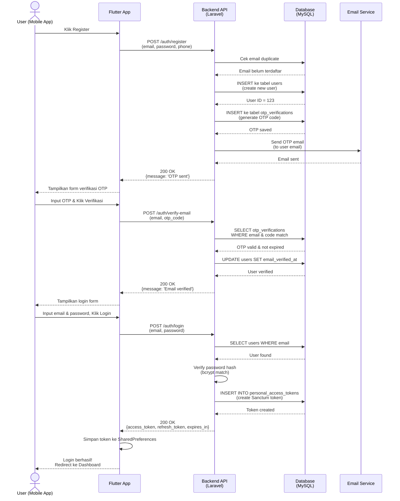
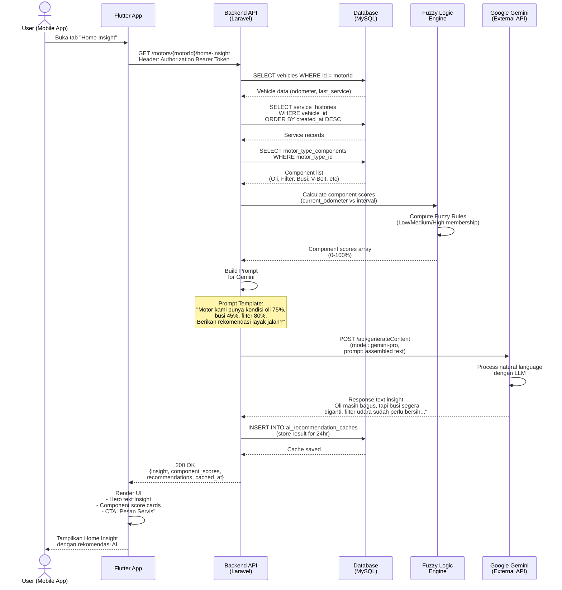
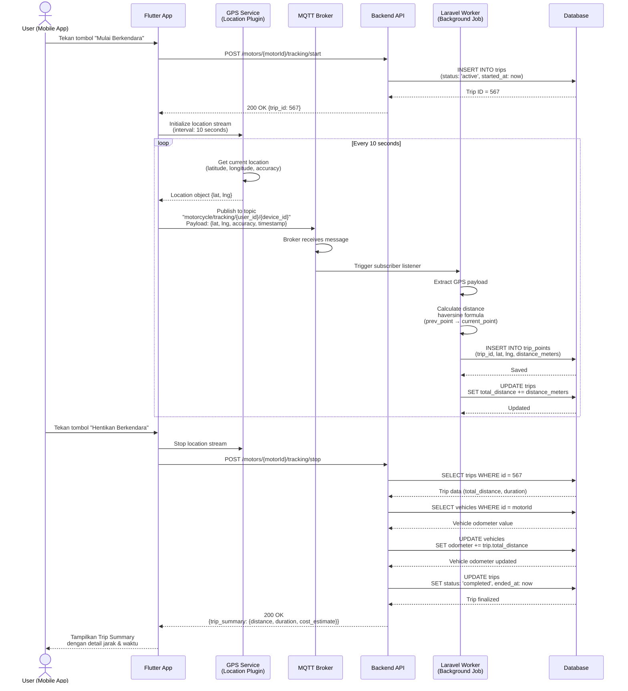
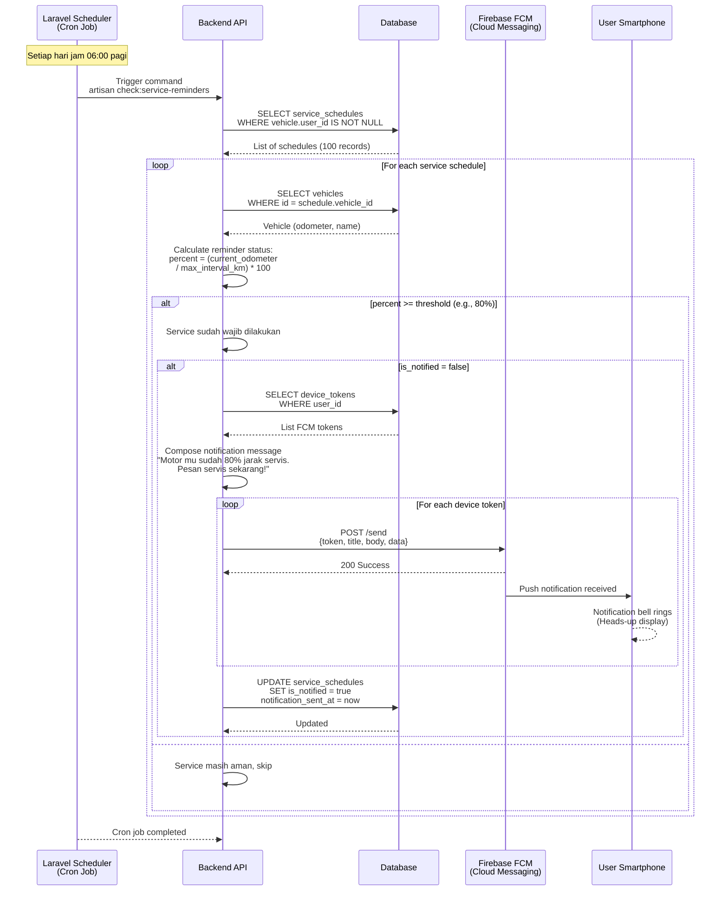
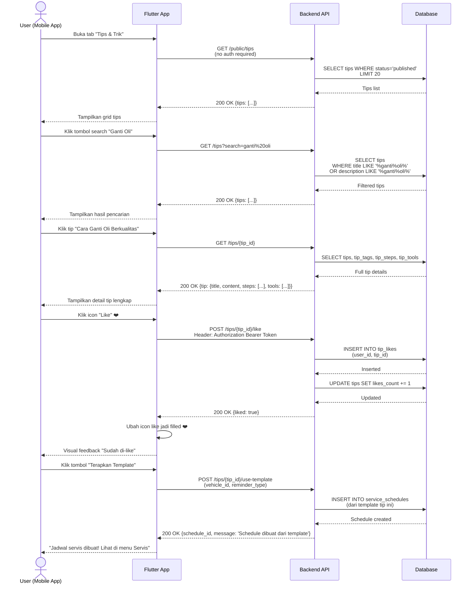
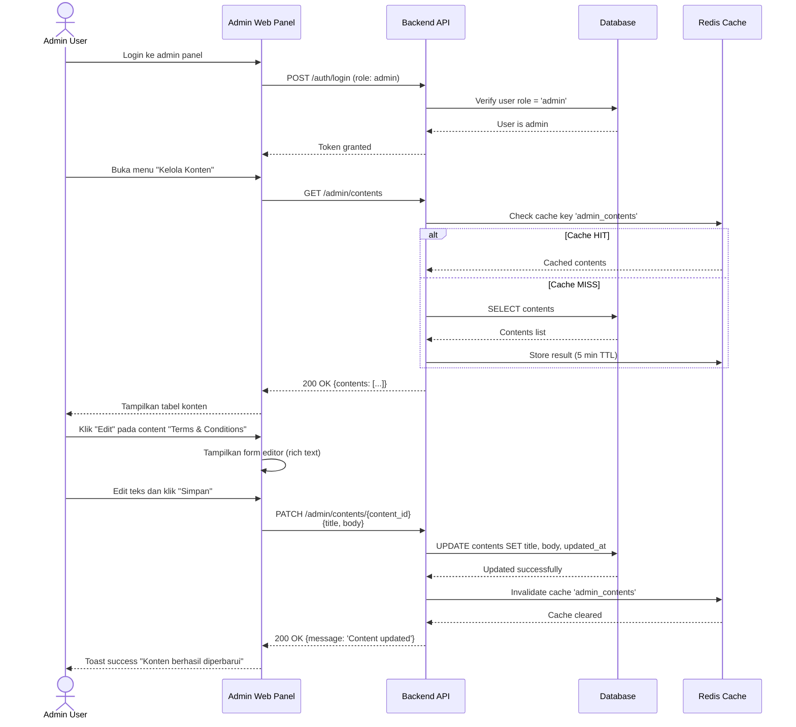

# SEQUENCE DIAGRAM - SISTEM SMART MOTORCYCLE MANAGEMENT

Dokumen ini menjelaskan alur interaksi antar komponen sistem melalui Sequence Diagram untuk setiap skenario utama.

---

## 1. SEQUENCE DIAGRAM: Alur Registrasi & Login

---

## 2. SEQUENCE DIAGRAM: Alur Smart Maintenance - AI Recommendation

---

## 3. SEQUENCE DIAGRAM: Alur GPS Tracking & Telemetry

---

## 4. SEQUENCE DIAGRAM: Alur Service Schedule Reminder & Notification

---

## 5. SEQUENCE DIAGRAM: Alur Tips/Content Interaction

---

## 6. SEQUENCE DIAGRAM: Alur Admin Panel - Manage Content

---

## Ringkasan Alur Proses

| Alur                   | Aktor              | Endpoint                        | Teknologi                  |
| ---------------------- | ------------------ | ------------------------------- | -------------------------- |
| **Registrasi & Login** | User               | `/auth/register`, `/auth/login` | Sanctum, Email Service     |
| **AI Recommendation**  | User               | `/motors/{id}/home-insight`     | Fuzzy Logic, Gemini API    |
| **GPS Tracking**       | User + System      | `/tracking/start/stop`          | MQTT, Location Plugin      |
| **Service Reminder**   | System + Scheduler | `artisan check:reminders`       | Cron Job, FCM              |
| **Tips Management**    | User               | `/tips`, `/tips/{id}/like`      | Database, Full-text Search |
| **Admin Management**   | Admin              | `/admin/contents`               | Database, Cache            |

---

**Catatan untuk Skripsi:**

- Diagram ini bisa Anda masukkan ke Bab 4 (Perancangan Sistem) sebagai visual sequence diagram
- Jelaskan setiap tahap interaksi dan teknologi yang digunakan
- Sertakan daftar HTTP methods dan status codes yang relevan
