# USE CASE DIAGRAM - SISTEM SMART MOTORCYCLE MANAGEMENT

## Diagram Use Case (Mermaid Format)

Berikut adalah Use Case Diagram lengkap sistem Motorcycle Management yang bisa Anda masukkan langsung ke laporan skripsi:

```mermaid
graph TB
    subgraph System["Sistem Smart Motorcycle Management"]
        subgraph Auth["Authentication & Profile"]
            UC1["Register & Email Verification"]
            UC2["Login / Logout"]
            UC3["Forgot & Reset Password"]
            UC4["Manage Profile"]
            UC5["Change Password"]
        end

        subgraph Vehicle["Vehicle & Maintenance"]
            UC6["Add Vehicle"]
            UC7["View Vehicles"]
            UC8["Set Primary Vehicle"]
            UC9["Delete Vehicle"]
            UC10["View Service History"]
            UC11["Add Service Record"]
            UC12["View Cost Breakdown"]
        end

        subgraph Maintenance["Smart Maintenance AI"]
            UC13["View Home Insight"]
            UC14["View Component Scores"]
            UC15["View Service Recommendation"]
            UC16["Create Service Schedule"]
            UC17["View Service Schedule"]
            UC18["Update Service Schedule"]
        end

        subgraph Tracking["Telemetry & Tracking"]
            UC19["Start GPS Tracking"]
            UC20["Stop GPS Tracking"]
            UC21["Add Manual Distance"]
            UC22["View Trip History"]
            UC23["View Usage Pattern"]
        end

        subgraph Tips["Tips & Knowledge Base"]
            UC24["Browse Tips"]
            UC25["Search Tips by Hashtag"]
            UC26["View Tip Details"]
            UC27["Like Tip"]
            UC28["Bookmark Tip"]
            UC29["Rate Tip"]
            UC30["Share Tip"]
            UC31["Use Template"]
        end

        subgraph Notification["Notification System"]
            UC32["Register Device Token"]
            UC33["View Notifications"]
            UC34["Mark Read Notification"]
            UC35["Delete Notification"]
            UC36["Set Notification Preferences"]
            UC37["Filter by Category"]
        end

        subgraph Admin["Admin Web Panel"]
            UC38["Manage Contents"]
            UC39["Manage Service Types"]
            UC40["Manage Reminder Options"]
            UC41["View Users"]
            UC42["View Analytics"]
        end

        subgraph System_Process["System Background Process"]
            UC43["Evaluate Service Schedule"]
            UC44["Send Reminder Notifications"]
            UC45["Calculate Fuzzy Logic"]
            UC46["Generate AI Insight"]
            UC47["Process MQTT Telemetry"]
        end
    end

    User["👤 Regular User<br/>(Member)"]
    Guest["👥 Guest User<br/>(Limited Access)"]
    Admin["🔐 Admin<br/>(Web Panel)"]
    System_Actor["⚙️ System<br/>(Background Job)"]
    Gemini["🤖 Google Gemini<br/>(External API)"]
    FCM["📲 Firebase FCM<br/>(External Service)"]
    MQTT["🌐 MQTT Broker<br/>(IoT Protocol)"]

    User -->|"uses"| UC1
    User -->|"uses"| UC2
    User -->|"uses"| UC3
    User -->|"uses"| UC4
    User -->|"uses"| UC5

    User -->|"uses"| UC6
    User -->|"uses"| UC7
    User -->|"uses"| UC8
    User -->|"uses"| UC9
    User -->|"uses"| UC10
    User -->|"uses"| UC11
    User -->|"uses"| UC12

    User -->|"uses"| UC13
    User -->|"uses"| UC14
    User -->|"uses"| UC15
    User -->|"uses"| UC16
    User -->|"uses"| UC17
    User -->|"uses"| UC18

    User -->|"uses"| UC19
    User -->|"uses"| UC20
    User -->|"uses"| UC21
    User -->|"uses"| UC22
    User -->|"uses"| UC23

    User -->|"uses"| UC24
    User -->|"uses"| UC25
    User -->|"uses"| UC26
    User -->|"uses"| UC27
    User -->|"uses"| UC28
    User -->|"uses"| UC29
    User -->|"uses"| UC30
    User -->|"uses"| UC31

    User -->|"uses"| UC32
    User -->|"uses"| UC33
    User -->|"uses"| UC34
    User -->|"uses"| UC35
    User -->|"uses"| UC36
    User -->|"uses"| UC37

    Guest -->|"uses"| UC1
    Guest -->|"uses"| UC2
    Guest -->|"uses"| UC24
    Guest -->|"uses"| UC25

    Admin -->|"uses"| UC38
    Admin -->|"uses"| UC39
    Admin -->|"uses"| UC40
    Admin -->|"uses"| UC41
    Admin -->|"uses"| UC42

    System_Actor -->|"executes"| UC43
    System_Actor -->|"triggers"| UC44
    System_Actor -->|"processes"| UC47

    UC43 -.->|"includes"| UC45
    UC45 -.->|"includes"| UC46
    UC46 -->|"calls"| Gemini

    UC44 -->|"sends via"| FCM
    UC47 -->|"receives from"| MQTT

    UC13 -.->|"depends on"| UC15
    UC15 -.->|"depends on"| UC45

    UC19 -.->|"depends on"| MQTT
    UC22 -.->|"depends on"| UC47

    style User fill:#e1f5ff
    style Guest fill:#fff3e0
    style Admin fill:#f3e5f5
    style System_Actor fill:#e8f5e9
    style Gemini fill:#fff9c4
    style FCM fill:#fce4ec
    style MQTT fill:#e0f2f1
```

---

## Penjelasan Use Case Diagram

### 1. **Aktor (Stakeholder)**

| Aktor                       | Deskripsi                                                            |
| --------------------------- | -------------------------------------------------------------------- |
| **Regular User (Member)**   | Pengguna terdaftar yang memiliki akun dan bisa mengakses semua fitur |
| **Guest User**              | Pengguna tanpa akun yang hanya bisa browsing tips dan konten publik  |
| **Admin**                   | Admin web yang mengelola master data dan konten sistem               |
| **System (Background Job)** | Proses otomatis backend seperti Cron Job dan worker daemon           |
| **Google Gemini**           | API eksternal untuk AI recommendation engine                         |
| **Firebase FCM**            | Layanan eksternal untuk push notification                            |
| **MQTT Broker**             | Protocol IoT untuk transmisi telemetri real-time                     |

---

### 2. **Pengelompokan Use Case**

#### **A. Authentication & Profile (6 Use Cases)**

- `Register & Email Verification` - Registrasi akun dengan verifikasi OTP
- `Login / Logout` - Masuk dan keluar aplikasi dengan Sanctum Token
- `Forgot & Reset Password` - Pemulihan akun via email
- `Manage Profile` - Edit nama, nomor telepon, upload avatar
- `Change Password` - Ubah password akun
- `Refresh Token` - Rotasi token otomatis untuk persistent login

#### **B. Vehicle & Maintenance (7 Use Cases)**

- `Add Vehicle` - Daftarkan motor baru ke dalam garasi digital
- `View Vehicles` - Lihat daftar semua motor milik user
- `Set Primary Vehicle` - Tentukan motor aktif untuk tracking
- `Delete Vehicle` - Hapus kendaraan dari garasi
- `View Service History` - Lihat riwayat perbaikan bengkel
- `Add Service Record` - Catat servis baru beserta biaya
- `View Cost Breakdown` - Analisis biaya perawatan per komponen

#### **C. Smart Maintenance AI (6 Use Cases)**

- `View Home Insight` - Lihat dashboard kesehatan motor dengan rekomendasi Gemini
- `View Component Scores` - Tabel rating kesehatan komponen (Fuzzy Logic)
- `View Service Recommendation` - Daftar teknis komponen yang kritis
- `Create Service Schedule` - Buat jadwal reminder servis otomatis
- `View Service Schedule` - Lihat kalender scheduled servis
- `Update Service Schedule` - Edit atau reset threshold/interval reminder

#### **D. Telemetry & Tracking (5 Use Cases)**

- `Start GPS Tracking` - Mulai merekam perjalanan
- `Stop GPS Tracking` - Hentikan tracking dan simpan trip
- `Add Manual Distance` - Input jarak manual jika GPS tidak tersedia
- `View Trip History` - Lihat rekam perjalanan sebelumnya
- `View Usage Pattern` - Analisis pola penggunaan motor (km/bulan)

#### **E. Tips & Knowledge Base (8 Use Cases)**

- `Browse Tips` - Jelajahi artikel tips perawatan motor
- `Search Tips by Hashtag` - Cari tips menggunakan filter tagar
- `View Tip Details` - Baca tip lengkap dengan langkah-langkah
- `Like Tip` - Tandai tip favorit
- `Bookmark Tip` - Simpan tip ke koleksi pribadi
- `Rate Tip` - Berikan rating 1-5 bintang
- `Share Tip` - Bagikan ke social media
- `Use Template` - Terapkan template tip langsung ke schedule

#### **F. Notification System (6 Use Cases)**

- `Register Device Token` - Daftar perangkat untuk FCM
- `View Notifications` - Lihat in-box notifikasi
- `Mark Read Notification` - Tandai notifikasi sudah dibaca
- `Delete Notification` - Hapus notifikasi dari in-box
- `Set Notification Preferences` - Toggle bunyi/pop-up per kategori
- `Filter by Category` - Filter notifikasi: Reminder, Promo, System

#### **G. Admin Web Panel (5 Use Cases)**

- `Manage Contents` - Edit konten publik (Terms, Privacy, FAQ)
- `Manage Service Types` - Daftar jenis servis (Maintenance, Repair, Modifikasi)
- `Manage Reminder Options` - Atur tipe pengingat (SMS, Push, Email)
- `View Users` - Melihat daftar pengguna dan statistik
- `View Analytics` - Dashboard performa sistem

#### **H. System Background Process (5 Use Cases)**

- `Evaluate Service Schedule` - Cek apakah service sudah overdue
- `Send Reminder Notifications` - Kirim FCM notifikasi ke user
- `Calculate Fuzzy Logic` - Komputasi skor kondisi komponen
- `Generate AI Insight` - Panggil Gemini API untuk narasi rekomendasi
- `Process MQTT Telemetry` - Proses data GPS dari IoT broker

---

### 3. **Relasi Antar Use Case**

#### **Include Relationship** (Garis putus-putus)

Menunjukkan bahwa satu use case selalu memanggil use case lain:

- `Evaluate Service Schedule` **includes** `Calculate Fuzzy Logic`
- `Calculate Fuzzy Logic` **includes** `Generate AI Insight`
- `View Home Insight` **depends on** `Generate AI Insight`

#### **Association Relationship** (Garis solid)

Menunjukkan bahwa aktor menggunakan/berinteraksi dengan use case:

- User → `Register`, `Login`, `Manage Vehicle`, dll
- System → `Evaluate Schedule`, `Send Notification`

#### **External Integration** (Aktor eksternal)

- `Generate AI Insight` → memanggil **Google Gemini API**
- `Send Reminder` → melalui **Firebase FCM**
- `Start GPS Tracking` → terima data dari **MQTT Broker**

---

## 4. Hubungan Workflow Use Case ke Implementasi API

Berikut mapping Use Case ke endpoint API yang sudah ada:

| Use Case                    | HTTP Method       | Endpoint                                                     |
| --------------------------- | ----------------- | ------------------------------------------------------------ |
| Register                    | POST              | `/api/v1/motorcycle/auth/register`                           |
| Login                       | POST              | `/api/v1/motorcycle/auth/login`                              |
| Refresh Token               | POST              | `/api/v1/motorcycle/auth/refresh-token`                      |
| View Profile                | GET               | `/api/v1/motorcycle/auth/me`                                 |
| Update Profile              | POST              | `/api/v1/motorcycle/profile/update`                          |
| Add Vehicle                 | POST              | `/api/v1/motorcycle/vehicles`                                |
| View Vehicles               | GET               | `/api/v1/motorcycle/vehicles`                                |
| Set Primary                 | POST              | `/api/v1/motorcycle/vehicles/{id}/set-primary`               |
| View Home Insight           | GET               | `/api/v1/motorcycle/motors/{motorId}/home-insight`           |
| View Scores                 | GET               | `/api/v1/motorcycle/motors/{motorId}/scores`                 |
| Service Recommendation      | GET               | `/api/v1/motorcycle/motors/{motorId}/service-recommendation` |
| Start Tracking              | POST              | `/api/v1/motorcycle/motors/{motorId}/tracking/start`         |
| Stop Tracking               | POST              | `/api/v1/motorcycle/motors/{motorId}/tracking/stop`          |
| Add Trip                    | POST              | `/api/v1/motorcycle/trips`                                   |
| View Trips                  | GET               | `/api/v1/motorcycle/trips`                                   |
| Browse Tips                 | GET               | `/api/v1/motorcycle/public/tips`                             |
| Create Schedule             | POST              | `/api/v1/motorcycle/service-schedules`                       |
| View Notifications          | GET               | `/api/v1/motorcycle/notifications`                           |
| Mark Read                   | PATCH             | `/api/v1/motorcycle/notifications/{id}/read`                 |
| Register Device             | POST              | `/api/v1/motorcycle/device-tokens/register`                  |
| Admin: Manage Contents      | POST/PATCH/DELETE | `/api/v1/motorcycle/admin/contents`                          |
| Admin: Manage Service Types | POST/PATCH/DELETE | `/api/v1/motorcycle/admin/service-types`                     |

---

## 5. Catatan untuk Skripsi

Saat menulis Bab 4 (Perancangan Sistem), Anda bisa:

1. **Letakkan diagram Mermaid di atas** sebagai visual representasi Use Case
2. **Buat tabel penjelasan** setiap use case dengan deskripsi singkat
3. **Jelaskan alur interaksi** antara aktor dan use case menggunakan **Sequence Diagram** per skenario
4. **Tunjukkan relasi include/extend** dengan penjelasan ketergantungan logika

Diagram ini sudah mencakup semua aspek fungsionalitas sistem Anda yang telah diimplementasikan! 🎯
